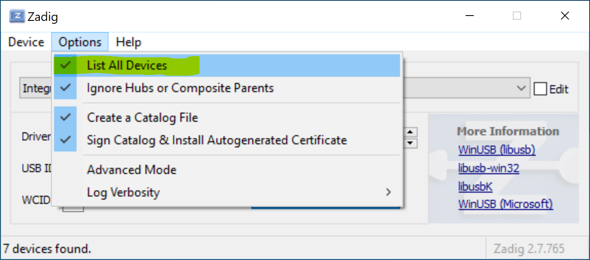
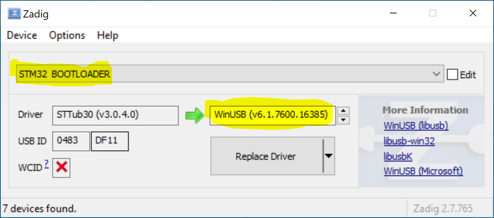
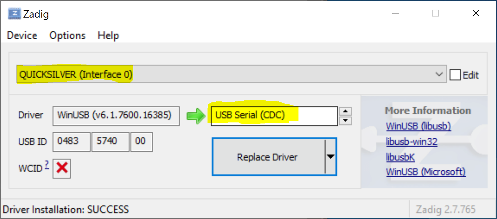

## DFU (Bootloader) not being detected. (Windows)

Hold the boot button or use the **Reset to Bootloader** function in the configurator  
Download and open [Zadig](https://zadig.akeo.ie/)

Ensure `List All Devices` is selected in the options.

Choose `STM32 BOOTLOADER` in the dropdown and select `WinUSB` in the right hand pane.  
Click `Replace Driver` and wait for it to finish.
Try flashing again in the configurator.

## No serial port showing after flashing. (Windows)

Unplug the fc and replug to ensure a power cycle  
Download and open [Zadig](https://zadig.akeo.ie/)

Ensure `List All Devices` is selected in the options.

Choose `QUICKSILVER` in the dropdown and select `USB serial (CDC)` in the right hand pane.  
Click `Replace Driver` and wait for it to finish. Power cycle again then try the configurator.

## BMI270 filter recommendations

The bmi270 gyros internal filtering differs from what other common gyros (mpu, icm) come with.
As such it needs slightly different software filtering. Recommended values are:

- A single gyro pt2 [filter](Configuring-Quicksilver.md#filter) at 100hz
- About half the d-term [pid gain](Configuring-Quicksilver.md#pid) (or kd) for Pitch and Roll, of what is specified in the presets.
