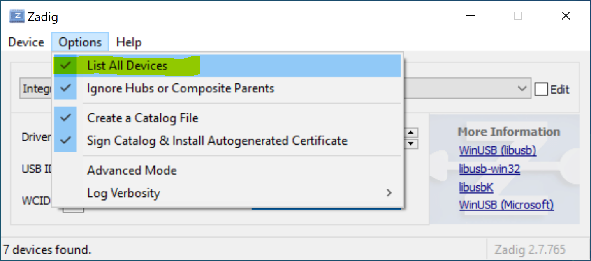
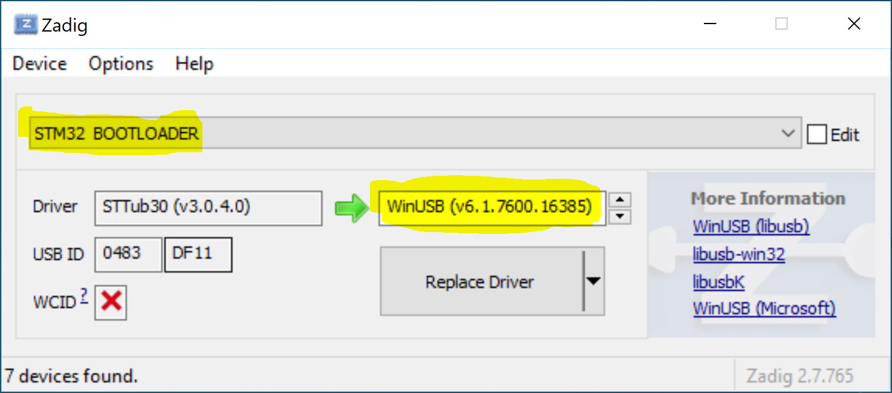
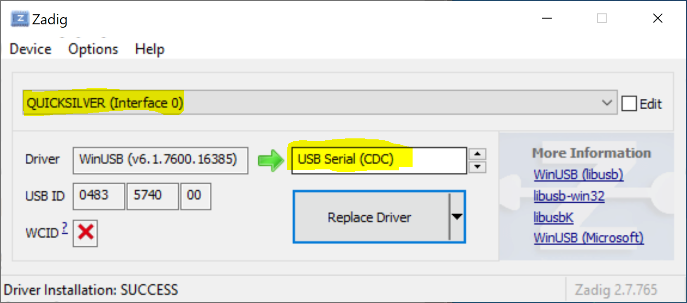
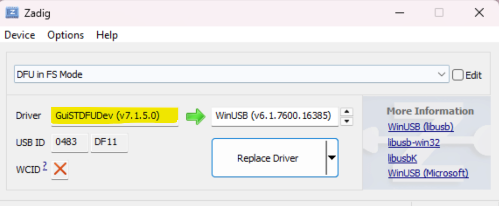

# Troubleshooting

## Connection and firmware compatibility

Use the [develop configurator](https://config.bosshobby.com/develop/) for current develop firmware. If Profile reports incompatible firmware or a fault, export the profile and record the reported version/error before reflashing.

Use a USB data cable, close other applications holding the serial port, and power-cycle after flashing. The normal serial port is used by **Connect**; the bootloader device is selected by **Flash firmware**. Some receivers and peripherals need battery power as well as USB.

## Unable to arm

End the configurator session and disconnect USB, lower the arm switch, then retry with a valid receiver link and safe throttle. An arm request during configuration latches an inhibit that unplugging alone does not clear.

Check the live channel mapping and AUX ranges in Receiver before disconnecting. Verify that Prearm is either **Always on** or correctly assigned and cycled. Reversible rovers require throttle near center; multirotors and wings require low throttle. An output-blocking failsafe also requires receiver recovery and an arm-switch cycle.

## Missing controls or tabs

The configurator adapts to firmware version, vehicle and hardware features. **Outputs**, **Control** and **Diagnostics** replace the older Motor, Rates and State tabs. GPS settings appear after assigning a GPS UART and rebooting. RTH controls currently apply only to multirotors; see [Navigation](Navigation.md).

## No receiver input after a v2 upgrade

Current v2 develop builds disable SPI receivers pending SPI interrupt-safety fixes. A target definition or legacy bind data cannot enable them. Check whether an onboard receiver uses SPI or UART; UART receivers remain supported. For a serial receiver, verify battery power, UART assignment, protocol and wiring, then apply changes and reboot. See [receiver support](Receivers-and-Passthrough.md#receiver-support-in-v2).

## OSD warnings and arming inhibits

Enable **System Status** in the OSD layout. These are the standard labels; alternate font sets can use different wording.

| Message | What to check |
| --- | --- |
| WAIT FOR RX | Receiver power, configured UART/protocol and a valid radio link |
| USB SAFETY | End the configuration session, disconnect USB and lower the arm switch |
| ARMING SAFETY | Lower the arm switch, check prearm and clear the condition that latched the inhibit |
| THROTTLE SAFETY | Lower aircraft throttle or center rover throttle; verify mapping/calibration |
| FAILSAFE | Restore a valid receiver link and follow the arm-switch recovery procedure |
| LOOPTIME | Record the firmware/target and inspect timing; this is not an ordinary rate-tuning prompt |
| LOW BATTERY | Actual pack voltage, cell count, calibration and the selected warning source |
| MOTOR TEST | Stop the active test before normal operation |

See [Navigation](Navigation.md) for RTH prerequisites and [Wings and rovers](Wings-and-Rovers.md) for launch/trim status.

## Controller failloop codes

A failloop is a fault that prevents normal operation. Record the code, exact target, vehicle and firmware revision before changing settings.

| Code | Meaning | First check |
| --- | --- | --- |
| 2 | Legacy low-battery-at-start code; currently unused | Confirm the reported code |
| 3 | Radio chip not found | Legacy SPI hardware/build context; SPI receivers are disabled in current builds |
| 4 | Gyro not found | Exact board target, gyro hardware and wiring |
| 5 | Clock, interrupt or system-tick fault | Correct firmware/target and a reproducible report |
| 6 | Flight loop exceeded 20 ms | Firmware/target and timing diagnostics |
| 7 | DMA error | Target resources and a reproducible report |
| 8 | SPI error | Target bus/device assignments and hardware |
| 9 | Vehicle not supported by target | Flash the matching vehicle/target combination |
| 10 | No target configured | Load the correct target and reboot, or reflash with target injection |
| 11 | Invalid servo PWM rate | Supported PWM rate and output configuration |

For reports, include the information listed in [Blackbox and diagnostics](Blackbox-and-Diagnostics.md). Do not repeatedly arm or run output tests while an unresolved hardware/configuration fault remains.

## Video or recording problems

If video works but the digital OSD is absent, check the **Digital VTX** UART, crossed TX/RX wiring, applied settings and DisplayPort support on the video system. If VTX channel/power requests do not take effect, compare desired and detected settings in [Video and OSD](Video-and-OSD.md).

If Blackbox has no recording, check storage availability, the saved recording settings and the Blackbox AUX indicator. Recording requires armed operation with that function active; a disarmed output test does not start a flight log. See the [recording workflow](Blackbox-and-Diagnostics.md).

## DFU (Bootloader) not being detected. (Windows)

Hold the boot button or use the **Reset to Bootloader** function in the configurator  
Download and open [Zadig](https://zadig.akeo.ie/)

Ensure `List All Devices` is selected in the options.

Choose `STM32 BOOTLOADER` in the dropdown and select `WinUSB` in the right hand pane.  
Click `Replace Driver` and wait for it to finish.
Try flashing again in the configurator.

## No serial port showing after flashing. (Windows)

Unplug the fc and replug to ensure a power cycle  
Download and open [Zadig](https://zadig.akeo.ie/)

Ensure `List All Devices` is selected in the options.

Choose `QUICKSILVER` in the dropdown and select `USB serial (CDC)` in the right hand pane.  
Click `Replace Driver` and wait for it to finish. Power cycle again then try the configurator.

## Exceptions with Guillemot/Thrustmaster drivers. (Windows)

The Guillemot/Thrustmaster Driver (GuiSTDFUDev) is 
preventing Windows from replacing the driver.
This driver is part of some Thrustmaster devices.
[Zadig](https://zadig.akeo.ie/) says the driver was successfully replaced,
but the Guillemot driver actually remains active 
if you start [Zadig](https://zadig.akeo.ie/) again.
In this case, uninstalling the Guillemot/Thrustmaster 
driver is the first step. 

## BMI270 filter recommendations

The BMI270's internal filtering differs from other gyro families. Current generic defaults already use a single gyro PT2 pass at 100 Hz. Check the actual [filter settings](Tuning.md#filters) after loading an older profile or template.

Use a tune appropriate to the craft and gyro. Inspect motor temperature and Blackbox data before changing [D gains](Tuning.md#pid-profiles-and-presets); an older instruction to halve every preset's D gain is not a universal requirement for current presets.

## RTH does not start

Check that you flashed a multirotor build, configured a GPS UART, have fresh valid GPS and barometer data, and armed with a valid home position. Acquiring GPS after arming does not create home for that flight. Check navigation throttle limits and cycle the RTH switch after correcting an unmet prerequisite. See [GPS and Return-to-Home](Navigation.md).
